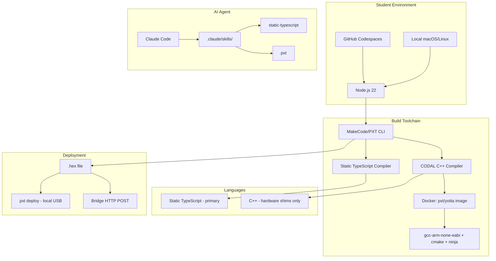
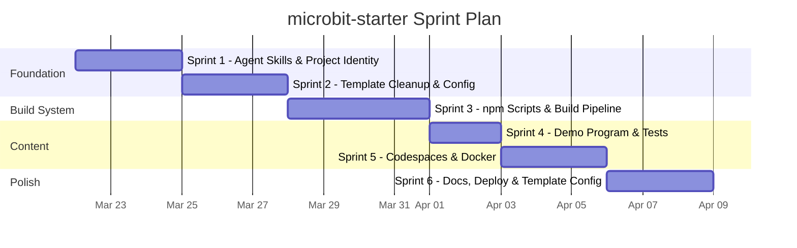

# Project Overview

## Project Name

microbit-starter

## Problem Statement

Students in a robotics league need a clean, ready-to-use GitHub template
repository for BBC micro:bit V2 projects. The current repository is a
working LeagueIR extension (NEC infrared protocol) — all source files,
tests, configuration, and documentation are IR-specific. Students cannot
use it as a starting point without manually stripping out IR code and
reconfiguring the build system.

Additionally, the MakeCode/PXT toolchain has significant quirks — Static
TypeScript restrictions, the files/testFiles split, C++ shim conventions,
block annotations — that waste student time. An AI agent (Claude Code)
with project-local skills should handle these framework details so students
focus on robotics, not toolchain configuration.

## Target Users

Students in a robotics league or course who:

- Have BBC micro:bit V2 boards
- Work primarily in GitHub Codespaces (or local macOS/Linux)
- Write TypeScript (MakeCode Static TypeScript) as their primary language
- May need C++ for hardware-level shims via CODAL
- Import each other's repos as MakeCode extensions
- Use an AI agent (Claude Code) as their primary source of help

## Key Constraints

- **Hardware:** micro:bit V2 only. No V1 support.
- **Language:** MakeCode Static TypeScript (primary), C++ via CODAL (shims only). No MicroPython.
- **Platform:** GitHub Codespaces (primary), macOS, Linux. No Windows support.
- **Build system:** npm scripts backed by JS files in `scripts/`. Node.js is a hard dependency (PXT requires it). No Make at project level.
- **Docker dependency:** C++ compilation requires a `pxt/yotta` Docker image (ARM cross-compilation with gcc-arm-none-eabi, cmake, ninja).
- **Import safety:** `main.ts` must be in `testFiles` so the repo is safe to import as an extension without pulling in the demo program.
- **No cloud compiler:** `PXT_FORCE_LOCAL=1` is set by default. All builds are local.

## High-Level Requirements

1. **Template cleanup** — Remove all LeagueIR-specific code (IR source files, IR tests, IR icon, IR docs, root Makefile) and generalize the repository into a blank starter template.

2. **npm scripts build system** — Replace Make with `npm run` commands (`setup`, `build`, `deploy`, `test`, `serve`, `clean`) backed by JS scripts with real error handling, precondition checks, and actionable failure messages.

3. **Demo program** — Ship a small `src/main.ts` demonstrating core V2 capabilities (speaker, microphone, touch logo, LED, compass) and a `src/robot.ts` scaffold with block annotations as a teaching feature.

4. **AI agent skills** — Create `.claude/skills/` with two skills:
   - `static-typescript` — STS language constraints, disallowed features, workarounds, common error mappings.
   - `pxt` — Framework patterns, block annotations, C++ shim conventions, files/testFiles split, extension authoring.

5. **CLAUDE.md** — Project identity, build commands, pxt.json rules, deploy behavior, skill pointers, and "what not to do" guardrails for the agent.

6. **Codespaces support** — `.devcontainer/devcontainer.json` with Node.js 22 base image, Docker-in-Docker feature, `postCreateCommand: npm run setup`, and port forwarding for bridge development.

7. **Bridge integration** — Deploy script reads `BRIDGE_URL` and `BRIDGE_KEY` from environment. If both set, POST hex to bridge. If either missing, fall back to `pxt deploy` (local USB). `.env.example` ships with variables commented out.

8. **Docker for C++ compilation** — Generalize the existing `docker/` directory (Dockerfile + Makefile) to build a `pxt/yotta` image for ARM cross-compilation. Setup script conditionally builds the image when `.cpp` files are present.

9. **GitHub template repository** — Configure the repo so students use "Use this template" to create their own repo with clean history.

## Technology Stack

| Layer | Technology |
|---|---|
| Primary language | Static TypeScript (MakeCode subset) |
| Secondary language | C++ (CODAL hardware shims) |
| Build framework | Microsoft MakeCode / PXT CLI |
| Build orchestration | npm scripts + JS files in `scripts/` |
| C++ cross-compilation | Docker image (`pxt/yotta`) with gcc-arm-none-eabi, cmake, ninja, python3, srec_cat |
| Runtime target | BBC micro:bit V2 (CODAL runtime) |
| Dev environment | GitHub Codespaces (Node.js 22 devcontainer, Docker-in-Docker) |
| AI assistance | Claude Code with project-local skills |
| Version control | Git + GitHub (template repository) |

## Sprint Roadmap

**Sprint 1 — Agent Skills & Project Identity**
Create `.claude/skills/static-typescript/SKILL.md`, `.claude/skills/pxt/SKILL.md` (with `references/block-annotations.md`), and `CLAUDE.md`. The agent becomes useful immediately for all subsequent sprints.

**Sprint 2 — Template Cleanup & Configuration**
Delete all LeagueIR-specific files (IR source, IR tests, icon, DEVELOPMENT.md, root Makefile). Write the new `pxt.json`, `package.json` (scripts stubs), `tsconfig.json`, `.gitignore`, and `.env.example`.

**Sprint 3 — npm Scripts & Build Pipeline**
Implement `scripts/setup.js`, `scripts/build.js`, and `scripts/deploy.js` with full error handling, precondition checks, and bridge integration logic. Verify `npm run setup && npm run build` works end-to-end.

**Sprint 4 — Demo Program & Tests**
Write `src/main.ts` (V2 demo), `src/robot.ts` (scaffold with block annotations), and `test/test.ts`. Confirm the build compiles and the demo program is excluded when imported as an extension.

**Sprint 5 — Codespaces & Docker**
Write `.devcontainer/devcontainer.json` and `.vscode/settings.json`. Generalize `docker/` (update README, verify Dockerfile is generic). Test Codespace creation flow.

**Sprint 6 — Documentation, Deploy & Template Config**
Write student-facing `README.md` (setup, quick start, "ask the agent"). Finalize deploy script bridge integration. Enable GitHub template repository setting. End-to-end test in a clean environment.

## Out of Scope

- **MicroPython** — Not supported. MakeCode Static TypeScript is the only student-facing language.
- **Windows** — Dev environment targets Codespaces, macOS, and Linux only.
- **micro:bit V1** — Students have V2 boards. Build config skips V1/DAL entirely (`PXT_COMPILE_SWITCHES=csv---mbcodal`).
- **Radio debug module** — No radio debug code ships in the template. Radio debugging is handled by the bridge service. Students just call `radio.setGroup()` and `radio.sendString()`.
- **Bridge server implementation** — The bridge is a separate project/repo. This template contains only the client-side integration (reading env vars, POSTing the hex file).
- **MakeCode extension gallery publishing** — `"public": false` in pxt.json. Students import each other's repos by GitHub URL, not through the gallery.
- **Test framework** — A structured test helpers namespace is deferred. Test files are ad hoc due to device constraints.
- **Docker image registry** — Pushing `pxt/yotta` to GitHub Container Registry is deferred until Codespace rebuild frequency is observed.
